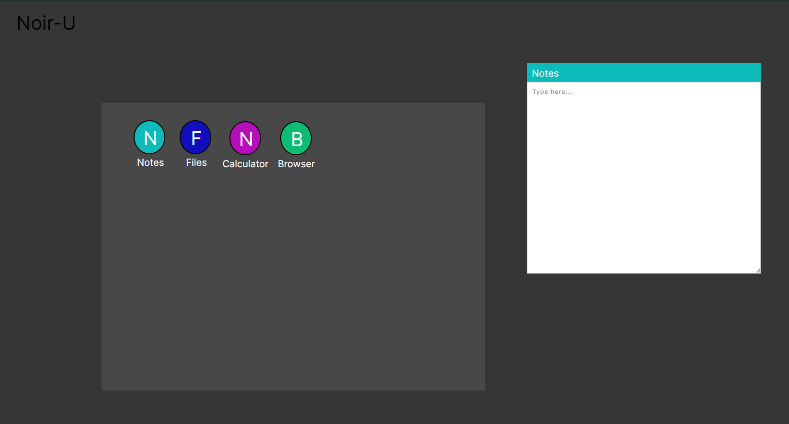
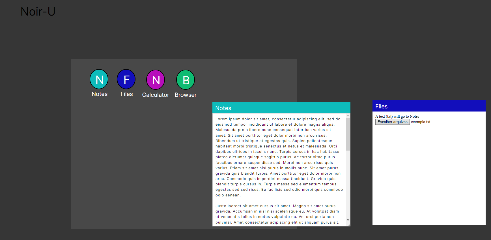
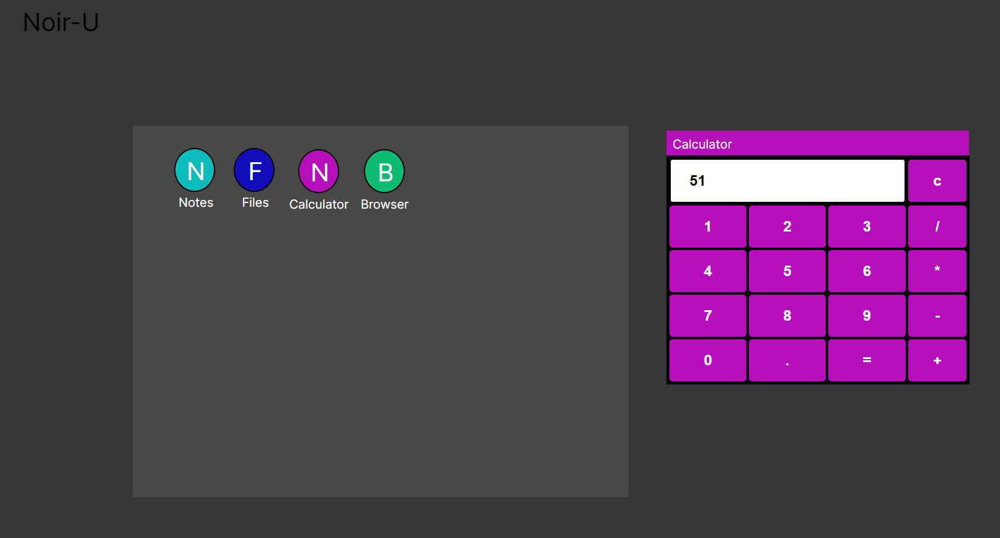
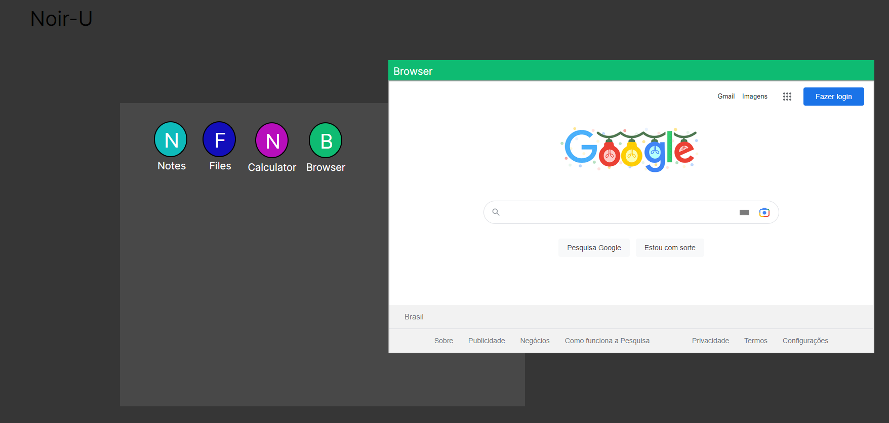

# NOIR-U - Projeto de sistema operacional web/cloud
## Índice

- [Instalação](#Instalação)
- [Uso](#Uso)
- [Dependências](#Dependências)

## Instalação

Basta rodar o arquivo index.html, recomendado o uso da exteção LiveServer se estiver utilizando o VScode.

## Uso

Todas as 4 funções possuem podem ser abertas simultaneamente e podem ser arrastadas dentro do espaço limite.

Bloco de notas com persistência de dados mesmo após um refresh

File upload de texto que é transferido para o bloco de notas
 
 
Calculadora com funções operações essenciais básicas
 

Iframe com o motor de busca Google, outros sites também podem ser acessados via o motor de busca
 

## Referencias

Draggable solution https://www.w3schools.com/howto/howto_js_draggable.asp

Calculator base https://www.geeksforgeeks.org/html-calculator/

File reader https://stackoverflow.com/questions/31746837/reading-uploaded-text-file-contents-in-html